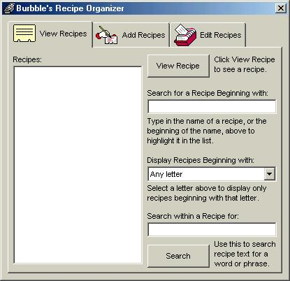



## Recipe Organizer

### Description

This is a simple program for organizing recipes. To begin, add a collection of recipes. When you later need to look one up, simply run the program, search your database of recipes for the recipe you want, and you can print out a copy of the recipe. The program can list recipes beginning with a letter you specify, or any string of text, or you can search within the text of the recipe for a word or phrase you are looking for.

The interface is very simple and easy to use.

Enjoy!

-Burbble
 
### More Info
 

             |
---                |---
**Submitted On**   |2002-09-28 12:40:32
**By**             |[Burbble](https://github.com/Planet-Source-Code/PSCIndex/blob/master/ByAuthor/burbble.md)
**Level**          |Beginner
**User Rating**    |5.0 (25 globes from 5 users)
**Compatibility**  |VB 6\.0
**Category**       |[Complete Applications](https://github.com/Planet-Source-Code/PSCIndex/blob/master/ByCategory/complete-applications__1-27.md)
**World**          |[Visual Basic](https://github.com/Planet-Source-Code/PSCIndex/blob/master/ByWorld/visual-basic.md)
**Archive File**   |[Recipe\_Org1376219282002\.zip](https://github.com/Planet-Source-Code/burbble-recipe-organizer__1-39333/archive/master.zip)

